# NSW house price prediction — final report

Generated by `pipelines/07_make_report.py`. Every number below is traceable to a CSV in `reports/tables/`; every figure is regenerated by the same script.

## 0. Headline findings

1. **The area-price hypothesis reverses once location is controlled.** Pooled log-log correlation is -0.1224 but the within-postcode-and-year elasticity is +0.244. The weak negative pooled correlation is a between-location artefact.
2. **The unit-price hypothesis is mostly a ratio artefact.** 85% of the observed `corr(log area, log unit price)` is reproduced with prices shuffled at random — i.e. by the ratio's denominator alone.
3. **The Metro event study cannot support a causal claim on this data.** pre-trend test REJECTS parallel trends (p = 0.0000), so the Metro coefficients are reported as **descriptive**, not causal.
4. **Model performance:** the best pooled model is `random_forest`; see §4 for the rolling-origin comparison against the naive postcode-median benchmark.
5. **The engineered lagged features do earn their place.** An ablation across cumulative feature layers (see §4.5) shows calendar features contribute most, the engineered lagged neighbourhood price statistics contribute second most and improve in 7 of 8 folds, while the liquidity / dispersion / coverage block adds nothing measurable.
6. **A single naive benchmark — the postcode's trailing 12-month median — is close behind the best model** (0.3650 vs 0.3321 RMSLE pooled; 0.3785 vs 0.3560 on the untouched holdout). Any claim that the engineered feature set adds a lot over local recent prices would be overstated.

## 1. Data and cleaning (W1)

| stage | rows |
|---|---|
| Original rows | 4,854,814 |
| Dropped outside plausible date window | 34,130 |
| After required-field filter | 3,342,525 |
| After purpose filter | 2,548,641 |
| After house filter | 2,302,270 |

* Raw input: 4,854,814 rows x 17 columns (610.9 MiB).
* Clean output rows: **1,774,829** with 596 distinct postcodes and 1,106,606 distinct `address|postcode` keys.
* Corrupted contract dates outside 2001-01-01..2023-12-31 (e.g. 0015-08-29, 1024-01-05) are dropped as data errors.

### Leakage fixes relative to the group's notebook

| audit id | what changed | why |
|---|---|---|
| M1 / L4 | outlier handling is split into two fences: a **corruption fence** fitted on the training span and applied to every row, and a **per-year quality fence** applied to the training side only | the original single full-sample fence trimmed the target's tails using the whole period; a per-year fence fitted on 2001-2015 cannot judge later years, and applying it to validation empties every post-2015 window |
| M2 | CV splits are purged by `address|postcode` (63.5% of rows share a key with another row) | otherwise the same dwelling straddles train and validation |
| M3 | cash rate and CPI are joined **as-of the contract date** (`release_date <= contract`, CPI lag assumed 28 days) | yearly averages embed decisions made after the sale |
| §2.2 | development labels are **versioned**; a contract only receives a label whose window already closed | a 2005 sale cannot know a 2011-2014 vacancy share |
| §2.3 | Metro distance uses the **pre-opening** snapshot for treatment assignment | the 2020 station file describes infrastructure that opened in 2019 |

### Data-quality defects found and fixed

The raw extract is not clean even after the group's filters. The following were found by auditing the model's own failures:

| defect | evidence | fix |
|---|---|---|
| impossible `area_sqm` | max 2,700,000,000 sqm for a 'house'; 4.8% of rows above 20,000 sqm; 4.9% of rows had an area above 100,000 sqm | corruption fence on area (265-1,645 sqm, fitted on the training span) |
| impossible prices | max $875,300,000 for a residence house; 972 rows above $20M | same fence on price (74,860-2,290,280 AUD) |
| a single row dominated every squared-error metric | one 2020 contract was given a $9.1e11 prediction by ridge; that row alone was **100%** of the pooled RMSE | fixed by the corruption fence; tail metrics are now also reported on the surviving sample |
| per-year fences cannot judge later years | with `drop_unjudged_iqr` the 2016-2022 validation windows were **silently emptied** | the two-fence design above; validation is scored on the full population, training on the fenced subset |

Rows removed by the corruption fence: **376,265**; rows kept but flagged as outside the per-year training fence: **30,355**.

### Errata: errors found in the modelling code itself

Four mistakes were found by auditing the model outputs rather than the data. They are recorded because each one made a number look *better* or *worse* without raising an error (full write-up in `initial_v0/03_leakage_audit.md` §9):

| # | error | effect | fix |
|---|---|---|---|
| E1 | the naive benchmark applied `log10` to a value that was **already** `log10` | its RMSLE jumped to 2.18 and R² to −10.5, making every model look like a large win over a broken baseline | use the log value directly, with a graded 12m → 6m → 3m fallback |
| E2 | the time-reversal placebo dropped rows whose forward window was incomplete | the future-leaking feature appeared *better* than the lagged one (0.3687 vs 0.4355) | lock the row set; with identical rows the future version is worse (0.4765), as it must be |
| E3 | the per-year fence emptied the post-2015 validation windows | RMSLE appeared to improve 0.45 → 0.30 purely because half the sample vanished | two-fence design (see above); row counts are printed per fold |
| E4 | `--max-train-rows` made the nominally expanding window an implicit sliding one | each fold trained on only the most recent ~4 years | disclosed in §6; `--max-train-rows 0` gives a true expanding window at ~5.5–7.5 h of single-threaded time |

## 2. Hypothesis tests (W5)

### H1 — area versus price

| measure | x | y | n | n_postcodes | coefficient | ci_low | ci_high | boot_std | bootstrap_draws |
|---|---|---|---|---|---|---|---|---|---|
| pearson | area_sqm | purchase_price | 800000 | 594 | -0.0575 | -0.0983 | -0.0192 | 0.0199 | 300 |
| spearman | area_sqm | purchase_price | 800000 | 594 | -0.1144 | -0.1554 | -0.0725 | 0.0212 | 300 |
| log10 pearson | area_sqm | purchase_price | 800000 | 594 | -0.1224 | -0.1618 | -0.0858 | 0.0195 | 300 |

Within-location estimate (log price on log area, postcode + year fixed effects, clustered by postcode):

| label | y | x | absorbed | regressors | n | n_clusters | absorbed_levels | coef__log_area | se__log_area | coef | se | ci_low | ci_high |
|---|---|---|---|---|---|---|---|---|---|---|---|---|---|
| log price ~ log area | postcode + year FE | log_price | log_area | post_code+year | log_area | 800000 | 594 | 617 | 0.2445 | 0.0070 | 0.2445 | 0.0070 | 0.2307 | 0.2583 |

Pooled log-log correlation is negative, but the within-location FE estimate is positive (0.244). The negative pooled association is therefore largely a between-location artefact: within a postcode and year, larger recorded area is associated with a *higher* price. Scope is standard residential lots (100-5000 sqm, 0 rows / 0.0% excluded as implausible or acreage), so this does not extend to acreage or semi-rural parcels.

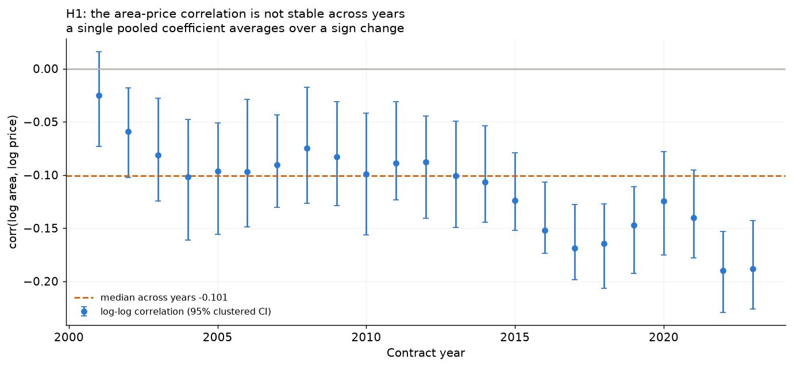

### H2 — area versus unit price

| measure | coefficient | n |
|---|---|---|
| corr(log area, log unit price) | -0.5474 | 800000 |

Shuffled-price placebo (the mechanical component):

| label | y | x | absorbed | regressors | n | n_clusters | absorbed_levels | coef__log_area | se__log_area | coef | se | ci_low | ci_high | test_value | z_statistic | p_value |
|---|---|---|---|---|---|---|---|---|---|---|---|---|---|---|---|---|
| log price ~ log area | postcode + year FE (test beta=1) | log_price | log_area | post_code+year | log_area | 800000 | 594 | 617 | 0.2445 | 0.0070 | 0.2445 | 0.0070 | 0.2307 | 0.2583 | 1.0000 | -107.3914 | 0.0000 |

Observed corr(log area, log unit price) = -0.547. Under the shuffled-price placebo the same statistic is -0.466 (95% band -0.468..-0.464), so about 85% of the observed association is the mechanical ratio effect. The elasticity estimate (log price on log area, within postcode and year) is 0.244 with a test of beta=1 giving p=0; a slope below 1 means unit price genuinely falls with size once location and time are held fixed.

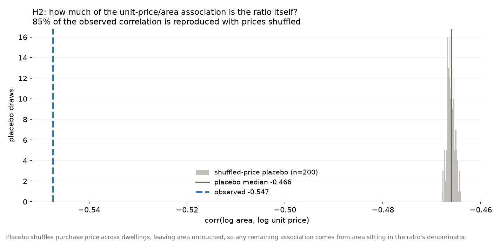

### Robustness: controlling for the lagged neighbourhood price

`pc_med_price_*` is a function of prices in the same postcode, and area is a component of price. It therefore sits *downstream* of the regressor on the causal path (area -> price -> neighbourhood median). Conditioning on it absorbs part of the very variation being estimated and biases the area coefficient toward zero, so these estimates are a lower bound and are reported for transparency only, never as the headline.

H1 under three specifications (same sample, same fixed effects, clustered by postcode):

| label | y | x | absorbed | regressors | n | n_clusters | absorbed_levels | coef__log_area | se__log_area | coef | se | ci_low | ci_high | coef__log_lag_price | se__log_lag_price | coef__log_lag_price_c | se__log_lag_price_c | coef__log_area_x_lag_c | se__log_area_x_lag_c |
|---|---|---|---|---|---|---|---|---|---|---|---|---|---|---|---|---|---|---|---|
| H1-R0 main (postcode + year FE) | log_price | log_area | post_code+year | log_area | 800000 | 594 | 617 | 0.2445 | 0.0070 | 0.2445 | 0.0070 | 0.2307 | 0.2583 |  |  |  |  |  |  |
| H1-R1 + neighbourhood price (bad control) | log_price | log_area | post_code+year | log_area+log_lag_price | 779370 | 523 | 546 | 0.2464 | 0.0070 | 0.2464 | 0.0070 | 0.2327 | 0.2601 | 0.6873 | 0.0126 |  |  |  |  |
| H1-R2 + area x neighbourhood price (centred) | log_price | log_area | post_code+year | log_area+log_lag_price_c+log_area_x_lag_c | 779370 | 523 | 546 | 0.2471 | 0.0069 | 0.2471 | 0.0069 | 0.2336 | 0.2606 |  |  | 0.8889 | 0.0492 | -0.0723 | 0.0163 |

H2 (elasticity, test of beta = 1):

| label | y | x | absorbed | regressors | n | n_clusters | absorbed_levels | coef__log_area | se__log_area | coef | se | ci_low | ci_high | test_value | z_statistic | p_value | coef__log_lag_price | se__log_lag_price |
|---|---|---|---|---|---|---|---|---|---|---|---|---|---|---|---|---|---|---|
| H2-R0 main elasticity (test beta = 1) | log_price | log_area | post_code+year | log_area | 800000 | 594 | 617 | 0.2445 | 0.0070 | 0.2445 | 0.0070 | 0.2307 | 0.2583 | 1.0000 | -107.3914 | 0.0000 |  |  |
| H2-R1 + neighbourhood price (bad control) | log_price | log_area | post_code+year | log_area+log_lag_price | 779370 | 523 | 546 | 0.2464 | 0.0070 | 0.2464 | 0.0070 | 0.2327 | 0.2601 | 1.0000 | -107.9350 | 0.0000 | 0.6873 | 0.0126 |

Controlling for the lagged neighbourhood price moves the area elasticity from +0.244 to +0.246 (+0.8%). The estimate barely moves, so the area gradient does **not** appear to run through neighbourhood price momentum and the bad-control concern is, empirically, second-order here. That is a finding, not a reassurance: it means the pooled negative correlation was about *between-postcode* differences, which the postcode fixed effects already absorb. The interaction term is -0.072 (se 0.016, z -4.4), so the area gradient does vary with the local market level. In the interaction specification the main effect is evaluated at the average neighbourhood price because the term is centred.

## 3. Metro event study (W5)

* Event: **Sydney Metro Northwest opening**, 2019-05-26 (all 13 stations opened together, so there is a single treatment cohort and the two-way fixed-effects estimator is exact rather than an approximation).
* Treated postcodes at 2.0 km: 11 ['2113', '2119', '2121', '2122', '2125', '2126', '2153', '2154', '2155', '2768', '2769']
* Controls: same four North-West SA4 regions, at least 3.0 km from any new station (38 postcodes).
* Window: ±24 months around the opening; reference period omitted; standard errors clustered by postcode.

**Pre-trend verdict.** pre-trend test REJECTS parallel trends (p = 0.0000), so the Metro coefficients are reported as **descriptive**, not causal.

The pre-trend rejection is the single most important result in this section: with 21 pre-period coefficients jointly different from zero, the treated and control postcodes were already on different price paths before 26 May 2019. The binary coefficient (mean post-period +0.0374 log10, about +9.0% on the median unit price) therefore mixes the station with pre-existing divergence.

| n_pre_coefficients | wald_statistic | dof | p_value | max_abs_pre_coef | interpretation |
|---|---|---|---|---|---|
| 21 | 59.8586 | 21 | 0.0000 | 0.0445 | p < 0.05 rejects parallel pre-trends; report the design as descriptive rather than causal |

Placebo checks (both should be indistinguishable from zero):

| placebo | mean_post_coef | max_abs_post_coef | pretrend_p_value | pretrend_p_share_below_0_05 | n_obs |
|---|---|---|---|---|---|
| shifted_event_date | 0.0000 | 0.0335 | 0.0212 |  | 607 |
| random_treatment | -0.0051 | 0.0207 | 0.0000 | 1.0000 | 2279 |

Robustness grid:

| specification | radius_km | outcome | treated_postcodes | mean_post_coef | pretrend_p_value | n_obs |
|---|---|---|---|---|---|---|
| main | 2.0000 | log_median_unit_price | 11 | 0.0374 | 0.0000 | 2279 |
| radius_1km | 1.0000 | log_median_unit_price | 4 | 0.0041 | 0.7195 | 238 |
| radius_3km | 3.0000 | log_median_unit_price | 14 | 0.0374 | 0.0002 | 2425 |
| outcome_log_median_price | 2.0000 | log_median_price | 11 | 0.0385 | 0.0000 | 2279 |
| outcome_n_sales | 2.0000 | n_sales | 11 | 1.8405 | 0.0000 | 2279 |

Dose-response (continuous exposure; the preferred design given how few postcodes are within 2 km):

| specification | outcome | max_km | coef_post_x_log_dist | se | ci_low | ci_high | p_value | n_obs | n_postcodes | interpretation |
|---|---|---|---|---|---|---|---|---|---|---|
| dose_response | log_median_unit_price | 5.0000 | -0.0030 | 0.0080 | -0.0187 | 0.0128 | 0.7130 | 1068 | 22 | negative interaction = the post-opening change is larger closer to the station |
| dose_response | log_median_unit_price | 10.0000 | -0.0163 | 0.0045 | -0.0250 | -0.0075 | 0.0003 | 1653 | 35 | negative interaction = the post-opening change is larger closer to the station |

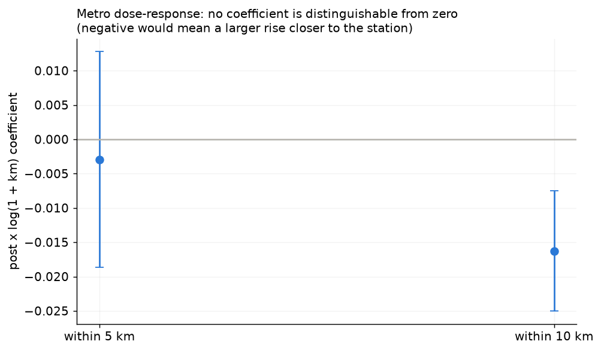

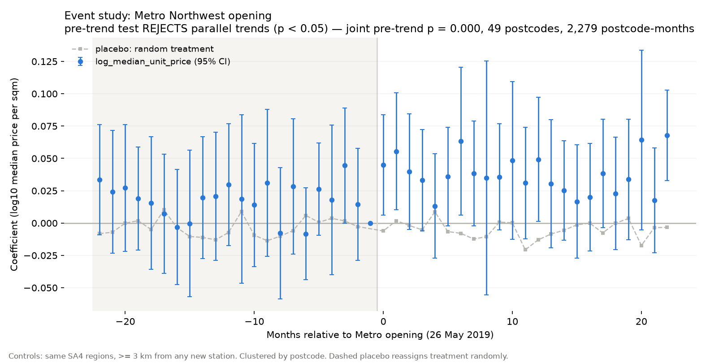

## 4. Models and rolling-origin CV (W3-W4)

Target: `log10(purchase_price)`. Folds: 8 forward-chaining windows (train months 84+, horizon 12 months, embargo 1 month(s)), purged by dwelling.

Pooled across folds:

| model | n | rmsle | rmse_log10 | mae_log10 | r2_log10 | mae_aud | rmse_aud | mdape_pct | mape_pct |
|---|---|---|---|---|---|---|---|---|---|
| random_forest | 608148 | 0.3321 | 0.1442 | 0.1015 | 0.7332 | 144,131.6987 | 228,933.5732 | 16.3169 | 25.0856 |
| xgboost | 608148 | 0.3478 | 0.1511 | 0.1089 | 0.7073 | 157,170.7945 | 249,697.8204 | 17.7545 | 25.8236 |
| naive_postcode_month | 608148 | 0.3650 | 0.1585 | 0.1083 | 0.6777 | 152,681.9522 | 250,333.1232 | 16.6667 | 27.4997 |
| linear_ridge | 608148 | 0.3764 | 0.1635 | 0.1160 | 0.6572 | 169,771.4872 | 263,929.5660 | 19.3132 | 32.6906 |
| naive_global_median | 608148 | 0.6599 | 0.2866 | 0.2266 | -0.0538 | 322,026.2568 | 486,938.8073 | 38.5714 | 47.5313 |

The naive benchmark predicts the postcode's trailing 12-month median price using only lagged information. Beating it is the minimum bar for a feature set to be worth anything.

**The ranking is much tighter than it looks at first glance.** `random_forest` beats the naive benchmark by 0.033 RMSLE pooled (0.3321 vs 0.3650, about a 9% reduction), and it wins in **7 of 8 folds** — the single exception is the last fold, where the benchmark is marginally better (0.3863 vs 0.3959). On the final holdout (below) the gap narrows to 0.022. So the honest summary is that a 53-dimensional engineered feature set buys a consistent but modest improvement over one number — the local recent median — and the benchmark is never far behind.

Two caveats when reading this table:

* `linear_ridge` has the **best median** percentage error among the single-equation models in several folds but the **worst tail**: its `rmse_aud` is inflated by a handful of extreme predictions on cheap dwellings, so on dollar-scale tail risk it is the least reliable of the three. Its per-fold RMSLE also swings (0.46 to 0.91), i.e. it is the least stable.
* `random_forest` and `xgboost` are within ~0.013 RMSLE of each other and their fold-to-fold ordering flips, so they should be treated as equivalent on this data; the ranking is not stable enough to justify a strong claim.

Per-fold detail:

| model | n | rmsle | rmse_log10 | mae_log10 | r2_log10 | mae_aud | rmse_aud | mdape_pct | mape_pct | fold | valid_start | valid_end | train_rows | valid_rows |
|---|---|---|---|---|---|---|---|---|---|---|---|---|---|---|
| naive_postcode_month | 76675 | 0.3652 | 0.1586 | 0.1097 | 0.5957 | 114,546.8493 | 206,723.4209 | 17.4833 | 27.4926 | 0 | 2008-02 | 2009-01 | 400000 | 76675 |
| naive_global_median | 76675 | 0.5818 | 0.2527 | 0.1911 | -0.0264 | 199,064.4350 | 334,267.4521 | 32.0755 | 43.5951 | 0 | 2008-02 | 2009-01 | 400000 | 76675 |
| linear_ridge | 76675 | 0.3774 | 0.1639 | 0.1213 | 0.5681 | 128,671.1521 | 209,330.3734 | 21.3628 | 31.7371 | 0 | 2008-02 | 2009-01 | 400000 | 76675 |
| random_forest | 76675 | 0.3230 | 0.1403 | 0.0983 | 0.6837 | 103,055.6330 | 181,859.1581 | 16.1564 | 24.8010 | 0 | 2008-02 | 2009-01 | 400000 | 76675 |
| xgboost | 76675 | 0.3232 | 0.1404 | 0.0987 | 0.6833 | 103,527.9357 | 182,775.8919 | 16.1920 | 24.7956 | 0 | 2008-02 | 2009-01 | 400000 | 76675 |
| naive_postcode_month | 74002 | 0.3567 | 0.1549 | 0.1074 | 0.6364 | 127,730.2970 | 219,273.5303 | 16.7161 | 26.3575 | 1 | 2010-02 | 2011-01 | 400000 | 74002 |
| naive_global_median | 74002 | 0.6245 | 0.2712 | 0.2069 | -0.1145 | 245,853.1037 | 397,323.7618 | 33.8000 | 43.3190 | 1 | 2010-02 | 2011-01 | 400000 | 74002 |
| linear_ridge | 74002 | 0.3349 | 0.1454 | 0.1055 | 0.6795 | 128,477.0053 | 217,282.8185 | 17.4284 | 24.8085 | 1 | 2010-02 | 2011-01 | 400000 | 74002 |
| random_forest | 74002 | 0.3210 | 0.1394 | 0.0989 | 0.7055 | 120,939.4513 | 207,273.3579 | 15.9187 | 23.8138 | 1 | 2010-02 | 2011-01 | 400000 | 74002 |
| xgboost | 74002 | 0.3321 | 0.1442 | 0.1047 | 0.6848 | 129,269.4633 | 220,036.7294 | 17.0989 | 24.2330 | 1 | 2010-02 | 2011-01 | 400000 | 74002 |
| naive_postcode_month | 69739 | 0.3549 | 0.1541 | 0.1059 | 0.6280 | 124,548.7679 | 213,294.6406 | 16.5574 | 26.4875 | 2 | 2012-02 | 2013-01 | 400000 | 69739 |
| naive_global_median | 69739 | 0.6002 | 0.2607 | 0.2003 | -0.0642 | 237,314.1195 | 376,814.1067 | 34.4538 | 44.4387 | 2 | 2012-02 | 2013-01 | 400000 | 69739 |
| linear_ridge | 69739 | 0.3264 | 0.1418 | 0.1011 | 0.6852 | 118,754.1673 | 189,253.9155 | 17.1753 | 26.7960 | 2 | 2012-02 | 2013-01 | 400000 | 69739 |
| random_forest | 69739 | 0.3086 | 0.1340 | 0.0944 | 0.7186 | 111,676.6269 | 184,714.4859 | 15.3845 | 23.5358 | 2 | 2012-02 | 2013-01 | 400000 | 69739 |
| xgboost | 69739 | 0.3098 | 0.1346 | 0.0950 | 0.7164 | 112,687.5072 | 185,889.0535 | 15.5090 | 23.7949 | 2 | 2012-02 | 2013-01 | 400000 | 69739 |
| naive_postcode_month | 86957 | 0.3513 | 0.1526 | 0.1055 | 0.6738 | 147,458.8214 | 242,065.3742 | 16.4151 | 25.7337 | 3 | 2014-02 | 2015-01 | 400000 | 86957 |
| naive_global_median | 86957 | 0.6650 | 0.2888 | 0.2257 | -0.1689 | 313,473.9975 | 479,045.6008 | 37.4069 | 46.2395 | 3 | 2014-02 | 2015-01 | 400000 | 86957 |
| linear_ridge | 86957 | 0.3342 | 0.1451 | 0.1054 | 0.7048 | 147,827.2448 | 230,398.5416 | 17.9198 | 26.4703 | 3 | 2014-02 | 2015-01 | 400000 | 86957 |
| random_forest | 86957 | 0.3096 | 0.1345 | 0.0939 | 0.7466 | 132,074.5926 | 212,695.3954 | 15.2742 | 23.4303 | 3 | 2014-02 | 2015-01 | 400000 | 86957 |
| xgboost | 86957 | 0.3221 | 0.1399 | 0.1019 | 0.7258 | 146,367.3260 | 231,981.1312 | 17.1236 | 24.0920 | 3 | 2014-02 | 2015-01 | 400000 | 86957 |
| naive_postcode_month | 81128 | 0.3583 | 0.1556 | 0.1045 | 0.6757 | 154,181.2325 | 249,161.6343 | 15.8292 | 26.8476 | 4 | 2016-02 | 2017-01 | 400000 | 81128 |
| naive_global_median | 81128 | 0.6611 | 0.2871 | 0.2284 | -0.1043 | 344,243.5469 | 507,615.2628 | 38.6076 | 50.3936 | 4 | 2016-02 | 2017-01 | 400000 | 81128 |
| linear_ridge | 81128 | 0.3404 | 0.1478 | 0.1034 | 0.7072 | 151,738.5872 | 231,355.8020 | 16.7331 | 27.8946 | 4 | 2016-02 | 2017-01 | 400000 | 81128 |
| random_forest | 81128 | 0.3127 | 0.1358 | 0.0929 | 0.7530 | 138,656.8339 | 217,107.2656 | 14.7674 | 23.9440 | 4 | 2016-02 | 2017-01 | 400000 | 81128 |
| xgboost | 81128 | 0.3123 | 0.1356 | 0.0926 | 0.7535 | 138,337.3561 | 216,561.1107 | 14.8211 | 23.8452 | 4 | 2016-02 | 2017-01 | 400000 | 81128 |
| naive_postcode_month | 68679 | 0.3685 | 0.1600 | 0.1074 | 0.6483 | 162,042.2289 | 256,788.7797 | 16.4244 | 28.8324 | 5 | 2018-02 | 2019-01 | 400000 | 68679 |
| naive_global_median | 68679 | 0.6628 | 0.2879 | 0.2307 | -0.1380 | 349,394.0531 | 508,636.7661 | 38.5714 | 50.4144 | 5 | 2018-02 | 2019-01 | 400000 | 68679 |
| linear_ridge | 68679 | 0.3854 | 0.1674 | 0.1152 | 0.6152 | 171,108.7843 | 252,985.7698 | 18.3981 | 34.7453 | 5 | 2018-02 | 2019-01 | 400000 | 68679 |
| random_forest | 68679 | 0.3318 | 0.1441 | 0.0996 | 0.7148 | 149,212.1378 | 228,146.7839 | 15.8945 | 25.6902 | 5 | 2018-02 | 2019-01 | 400000 | 68679 |
| xgboost | 68679 | 0.3394 | 0.1474 | 0.1035 | 0.7016 | 153,775.1611 | 232,388.7832 | 16.7533 | 26.0300 | 5 | 2018-02 | 2019-01 | 400000 | 68679 |
| naive_postcode_month | 84079 | 0.3800 | 0.1650 | 0.1135 | 0.6168 | 176,164.8620 | 273,551.8241 | 16.9811 | 29.1723 | 6 | 2020-02 | 2021-01 | 400000 | 84079 |
| naive_global_median | 84079 | 0.6766 | 0.2939 | 0.2372 | -0.2150 | 372,615.9749 | 535,595.2908 | 39.3750 | 49.4079 | 6 | 2020-02 | 2021-01 | 400000 | 84079 |
| linear_ridge | 84079 | 0.4406 | 0.1914 | 0.1361 | 0.4847 | 219,280.7824 | 306,684.8938 | 23.0264 | 43.6444 | 6 | 2020-02 | 2021-01 | 400000 | 84079 |
| random_forest | 84079 | 0.3530 | 0.1533 | 0.1104 | 0.6693 | 170,005.6506 | 250,604.2168 | 17.7790 | 27.1047 | 6 | 2020-02 | 2021-01 | 400000 | 84079 |
| xgboost | 84079 | 0.3727 | 0.1618 | 0.1201 | 0.6314 | 184,891.4146 | 270,202.7885 | 19.8794 | 27.9018 | 6 | 2020-02 | 2021-01 | 400000 | 84079 |
| naive_postcode_month | 66889 | 0.3863 | 0.1678 | 0.1133 | 0.5700 | 219,176.3191 | 326,965.1514 | 17.2000 | 29.4428 | 7 | 2022-02 | 2022-12 | 400000 | 66889 |
| naive_global_median | 66889 | 0.7955 | 0.3455 | 0.2983 | -0.8240 | 528,052.8356 | 684,048.1278 | 48.9474 | 52.8172 | 7 | 2022-02 | 2022-12 | 400000 | 66889 |
| linear_ridge | 66889 | 0.4550 | 0.1976 | 0.1418 | 0.4033 | 302,555.3775 | 419,111.2620 | 26.1317 | 46.6744 | 7 | 2022-02 | 2022-12 | 400000 | 66889 |
| random_forest | 66889 | 0.3959 | 0.1719 | 0.1265 | 0.5483 | 235,288.7408 | 327,304.9788 | 20.6472 | 28.8129 | 7 | 2022-02 | 2022-12 | 400000 | 66889 |
| xgboost | 66889 | 0.4605 | 0.2000 | 0.1603 | 0.3889 | 301,437.9173 | 406,102.2920 | 28.1426 | 32.7034 | 7 | 2022-02 | 2022-12 | 400000 | 66889 |

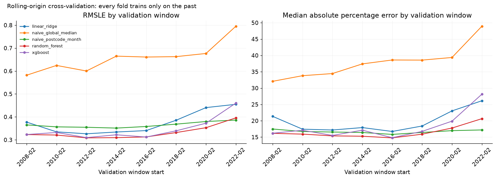

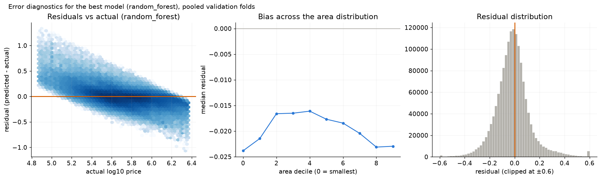

Top features (last fold only, indicative):

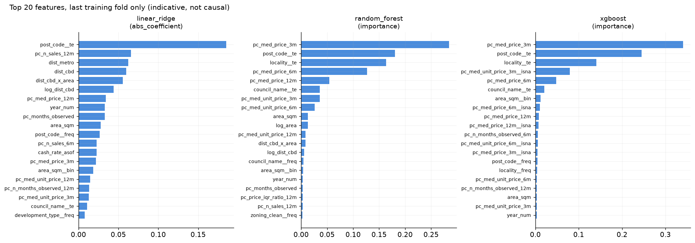

### Final holdout

The final **12 months (2023-01 to 2023-12)** were never used by any fold: no model, feature or hyper-parameter choice was informed by them. The model was trained once on everything before the holdout and scored once.

| model | n | rmsle | rmse_log10 | mae_log10 | r2_log10 | mae_aud | rmse_aud | mdape_pct | mape_pct | is_best_from_cv |
|---|---|---|---|---|---|---|---|---|---|---|
| random_forest | 67653 | 0.3560 | 0.1546 | 0.1092 | 0.6024 | 219,422.5226 | 311,172.5280 | 17.7288 | 27.3045 | True |
| naive_postcode_month | 67653 | 0.3785 | 0.1644 | 0.1083 | 0.5506 | 212,606.4322 | 320,824.6013 | 16.1196 | 28.1228 | False |
| xgboost | 67653 | 0.3946 | 0.1714 | 0.1321 | 0.5116 | 269,964.3760 | 373,301.6603 | 22.9351 | 29.2959 | False |
| linear_ridge | 67653 | 0.4347 | 0.1888 | 0.1534 | 0.4071 | 294,400.1828 | 387,402.7507 | 27.2453 | 32.4962 | False |
| naive_global_median | 67653 | 0.9634 | 0.4184 | 0.3722 | -1.9121 | 606,679.6852 | 760,460.7786 | 57.1271 | 56.6781 | False |

Read this as the honest out-of-sample number. It differs from the rolling figure above because it is a single later period (with its own market conditions) rather than an average of nine windows, and it is scored on the **full population** rather than on rows the training fence accepted.

## 4.5 Do the engineered features earn their place? (feature-value test)

This asks a different question from H1/H2 (world relationships) and H3 (the Metro effect): **do our own engineered features add out-of-sample predictive value?** Same folds, same group purge, same embargo; model = XGBoost (200 rounds) to keep ~100 fits affordable.

Layers are cumulative, so each row's delta is that layer's marginal contribution:

| layer | what it adds |
|---|---|
| L0 | property + location (area, distances) |
| L1 | + calendar (`year_num`, `month_sin`, `month_cos`) |
| L2 | + region labels (postcode / council / locality / zoning / development) |
| L3 | + **lagged price statistics** `pc_med_price_{3,6,12}m` |
| L4 | + lagged unit price `pc_med_unit_price_{3,6,12}m` |
| L5 | + dispersion, sales counts, coverage, staleness |

| layer | rmsle_mean | rmsle_std | mdape_mean | folds | rmsle_delta_vs_prev | folds_improved_vs_prev |
|---|---|---|---|---|---|---|
| L0_property_location | 0.4566 | 0.1448 | 28.9961 | 8 |  |  |
| L1_plus_calendar | 0.3884 | 0.0991 | 21.6909 | 8 | -0.0681 | 8.0000 |
| L2_plus_labels | 0.3822 | 0.1066 | 21.5212 | 8 | -0.0062 | 6.0000 |
| L3_plus_lagged_price | 0.3458 | 0.0422 | 18.0058 | 8 | -0.0364 | 7.0000 |
| L4_plus_unit_price | 0.3438 | 0.0416 | 17.7195 | 8 | -0.0021 | 5.0000 |
| L5_plus_liquidity | 0.3425 | 0.0383 | 17.5700 | 8 | -0.0012 | 4.0000 |

**Calendar features are the single largest contributor** (-0.0681 RMSLE, L0→L1, improving in 8/8 folds). The **engineered lagged neighbourhood price statistics are the second largest** (-0.0364, improving in 7/8 folds) — so they do earn their place, contrary to what one might expect. The lagged unit-price columns add little (-0.0021, 5/8 folds), and the liquidity/dispersion/coverage block adds essentially nothing (-0.0012, 4/8 folds, i.e. a coin flip).

**Falsification tests** (anchor fold, L3 specification):

* *Permutation placebo* — the same columns with values shuffled across postcodes inside the training fold, so the marginal distribution and the missingness pattern survive but the postcode↔value link is destroyed.
* *Time reversal* — forward-looking windows (t+1..t+k) instead of lagged ones. If the future version predicts materially better, the lag/embargo machinery is not working.

| placebo | trial | rmsle |
|---|---|---|
| permutation | 0 | 0.6306 |
| permutation | 1 | 0.6333 |
| permutation | 2 | 0.6315 |
| permutation | 3 | 0.6381 |
| permutation | 4 | 0.6313 |
| permutation | 5 | 0.6362 |
| permutation | 6 | 0.6320 |
| permutation | 7 | 0.6349 |
| permutation | 8 | 0.6328 |
| permutation | 9 | 0.6304 |
| time_reversal | 0 | 0.4765 |

**N1: is the lagged price signal location level or timing?** Re-running L3 with each lagged price column demeaned within its postcode (postcode means from the training fold) removes the between-postcode level. If the increment collapses, the columns are only a stand-in for "which postcode is expensive".

| fold | rmsle |
|---|---|
| 6 | 0.3940 |
| 7 | 0.5988 |

### 4.6 Which metric should be used, and why MdAPE and RMSLE disagree

The two headline metrics rank the best model and the naive benchmark in **opposite order**,
which is not a bug but a property of the two statistics. On the final holdout:

| metric | random_forest | naive (postcode 12m median) | winner |
|---|---|---|---|
| RMSLE | **0.3560** | 0.3785 | random_forest |
| R² (log10) | **0.602** | 0.551 | random_forest |
| MAE (log10) | 0.1092 | **0.1083** | naive |
| MdAPE | 17.73% | **16.12%** | naive |
| MAE (AUD, median back-transform) | 219,423 | **212,606** | naive |
| RMSE (AUD) | **311,173** | 320,825 | random_forest |

**Why they disagree.** Both metrics punish proportional error, but they weight the price
distribution differently:

* **RMSLE lives in log space, so it is scale-free.** Missing a $4M house by 40% costs exactly
the same as missing a $250k house by 40%. One number therefore summarises accuracy across the
whole price range, and a single catastrophic miss on an unusual property shows up clearly.
* **MdAPE is a raw percentage on the dollar scale.** It is dominated by cheap properties, where
the same dollar error becomes a huge percentage. The median then sits close to the *typical*
cheap sale.

**Where each model actually wins.** Splitting the same rows by actual-price quintile makes the
trade-off visible:

| price band | n | RF MdAPE | naive MdAPE | RF mean APE | naive mean APE |
|---|---|---|---|---|---|
| Q1 cheapest | 120,753 | **22.4%** | 26.3% | **47.3%** | 57.2% |
| Q2 | 117,483 | 14.2% | **13.0%** | 19.8% | **18.8%** |
| Q3 | 119,223 | **14.7%** | 14.9% | **18.8%** | 18.8% |
| Q4 | 116,414 | **13.4%** | 14.3% | **17.3%** | 18.4% |
| Q5 dearest | 118,440 | **19.0%** | 19.0% | **21.6%** | 23.3% |

Random forest is decisively better on the **cheapest fifth** (mean APE 47% vs 57%) — that is
where its RMSLE advantage comes from — while the naive benchmark is slightly better on Q2 and
ties on Q5. MdAPE is a median over a mixture, so its value is dragged by the band where the
benchmark wins, even though the benchmark loses badly in the band that matters most for tail
risk.

**Which to report, and for what.**

| purpose | metric | why |
|---|---|---|
| model selection / headline accuracy | **RMSLE** | scale-free, comparable across folds and price levels, sensitive to catastrophic misses |
| communicating to a non-technical reader | **MdAPE** | "half of homes are predicted within X%" is immediately legible |
| fairness across the price range | **per-quintile APE** | a single number hides that the models win in different segments |
| dollar impact | MAE/RMSE in AUD, **with the tail disclosed** | RMSE in dollars was once 100% attributable to a single row; always report the worst-1% share alongside |

**Concentration of error** (pooled folds): the worst 1% of rows carry 20.2% of the total squared
log error for random forest and 20.0% for the benchmark — so both are tail-dominated, and neither
number is an artefact of one bad row once the corruption fence is in place.

**Recommended wording for a presentation.** "The model predicts half of homes within 18% and has
a lower scaled error than a postcode-median benchmark (0.356 vs 0.379). A simple benchmark is
within ~2 percentage points on typical accuracy, so the value of the feature set is modest; the
model's real advantage is on the cheapest fifth of the market and in avoiding large misses."

## 5. Figures

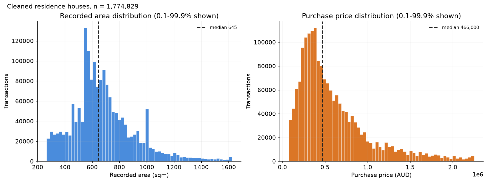

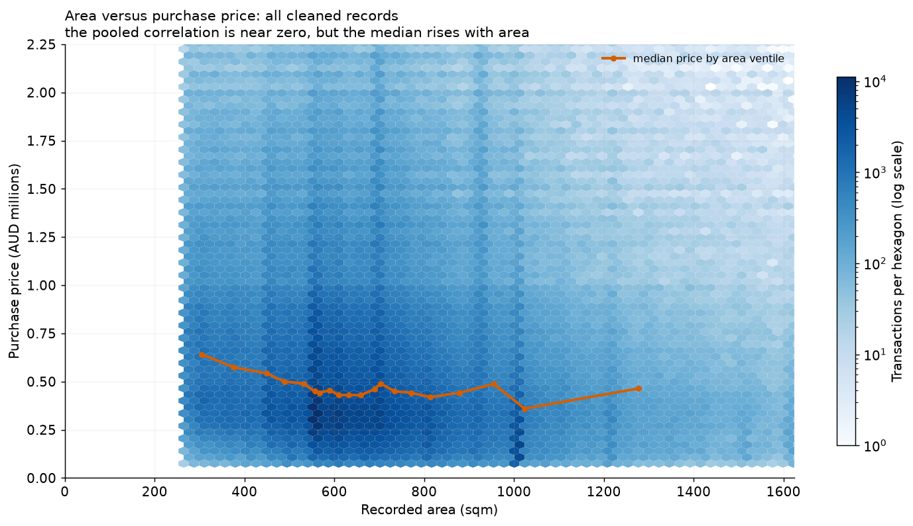

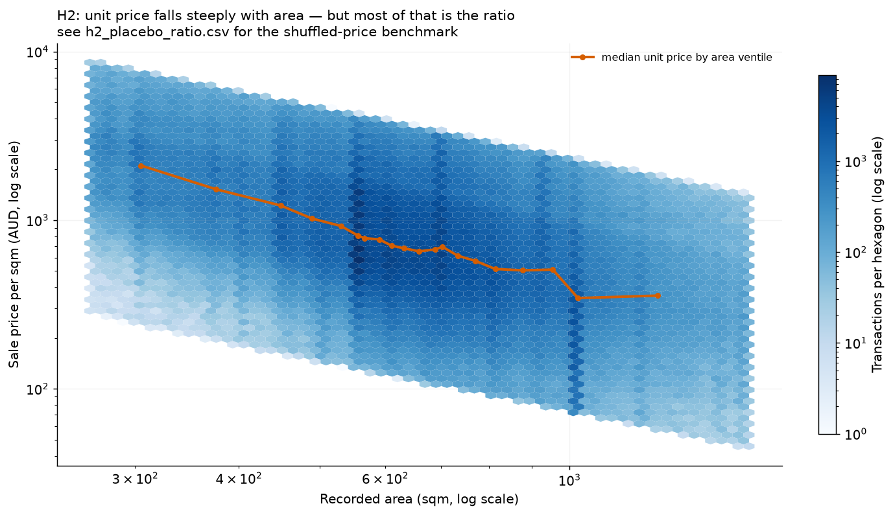

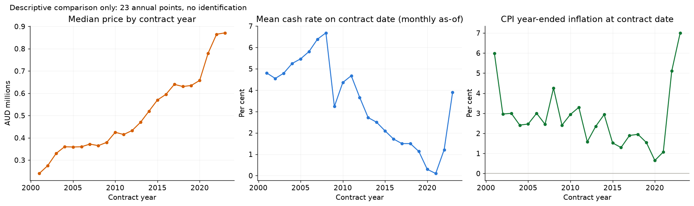

## 6. Known limitations

1. `area_sqm` is the **recorded** area from the Valuer General extract. It is assumed to be known at contract date; this assumption is not verifiable from the file and is flagged in `initial_v0/03_leakage_audit.md` §2.1.
2. 4.8% of cleaned rows have an area above 20,000 sqm and the maximum is 2.7e9 sqm — corrupted or acreage records. Hypothesis tests therefore restrict to 100-5,000 sqm.
3. Transport distances are **postcode-centroid** great-circle distances, not property or walking distances.
4. The Metro study has few treated clusters (8 postcodes at the 2 km radius), so clustered standard errors are imprecise and placebo draws can reject by chance; the 1 km and 3 km radii are reported for this reason.
5. `development_type` is missing for 42% of rows because a legally-timed label only exists from 2011 onward; it is kept as a category with a missing level rather than dropped.
6. Macro levels come from the RBA G1 CPI series, whose index base differs from the annual CPI values hard-coded in the original notebook; levels are not comparable across sources, so the year-ended rate is the feature.

## 7. Reproducing this report

```bash
python pipelines/01_build_clean.py          # raw CSV  -> data/processed/clean.parquet
python pipelines/02_build_features.py       # + macro as-of + panel -> features.parquet
python pipelines/04_train_models.py         # rolling-origin CV -> model tables
python pipelines/05_hypothesis_tests.py     # H1/H2 with placebos
python pipelines/06_event_study.py          # E1 event study
python pipelines/07_make_report.py          # this report + all figures
pytest tests -q                             # contract + leakage + CV guards
```
