# NSW house price prediction — final report

Generated by `pipelines/07_make_report.py`. Every number below is traceable to a CSV in `reports/tables/`; every figure is regenerated by the same script.

## 0. Headline findings

1. **The area-price hypothesis reverses once location is controlled.** Pooled log-log correlation is -0.1115 but the within-postcode-and-year elasticity is +0.246. The weak negative pooled correlation is a between-location artefact.
2. **The unit-price hypothesis is mostly a ratio artefact.** 85% of the observed `corr(log area, log unit price)` is reproduced with prices shuffled at random — i.e. by the ratio's denominator alone.
3. **The Metro event study cannot support a causal claim on this data.** pre-trend test REJECTS parallel trends (p = 1.09e-06), so the Metro coefficients are reported as **descriptive**, not causal.
4. **Model performance:** the best pooled model is `xgboost`; see §4 for the rolling-origin comparison against the naive postcode-median benchmark.
5. **Which engineered features earn their place depends on the layer, per the ablation in §4.5.** 4 of 7 blocks reduce pooled RMSLE. The largest gain is the calendar features (-0.0435). **3 of the 7 blocks make it worse** (the price-dispersion column, the macro block (RBA cash rate and CPI), the liquidity and coverage block), so the leanest model beats the full feature set: L4_plus_unit_price at 0.3253 against 0.3270 mean RMSLE.
6. **A single naive benchmark — the postcode's trailing 12-month median — is close behind the best model** (0.3622 vs 0.3182 RMSLE pooled; 0.3718 vs 0.3305 on the untouched holdout). Any claim that the engineered feature set adds a lot over local recent prices would be overstated.
7. **A 16-feature model matches the 27-feature one, so the three net-negative layers can be dropped.** §4.5's ablation is run at different settings from the production model, so §4.8 repeats it like-for-like: same algorithm, same folds, same training windows. The lean model (dropping dispersion, liquidity/coverage and macro) is ahead by 0.0004 on the validation folds and by 0.0050 on the untouched 2023 holdout, and fits about 18% faster per fold (17.2s against 21.0s). The fold-level margin is inside the noise, so this is a "no evidence they help" conclusion rather than a demonstrated gain — and **the production configuration is left unchanged**, so every number in §4 still refers to the full feature set.

## 1. Data and cleaning (W1)

| stage | rows |
|---|---|
| Original rows | 4,854,814 |
| Dropped outside plausible date window | 34,130 |
| After required-field filter | 3,342,525 |
| After purpose filter | 2,548,641 |
| After house filter | 2,302,270 |

* Raw input: 4,854,814 rows x 17 columns (610.9 MiB).
* Clean output rows: **1,720,833** with 596 distinct postcodes and 1,099,965 distinct `address|postcode` keys.
* Corrupted contract dates outside 2001-01-01..2023-12-31 (e.g. 0015-08-29, 1024-01-05) are dropped as data errors.

### Leakage fixes relative to the group's notebook

| audit id | what changed | why |
|---|---|---|
| M1 / L4 | outlier handling is split into two fences: a **corruption fence** fitted on the training span and applied to every row, and a **per-year quality fence** applied to the training side only | the original single full-sample fence trimmed the target's tails using the whole period; a per-year fence fitted on 2001-2015 cannot judge later years, and applying it to validation empties every post-2015 window |
| M2 | CV splits are purged by `address|postcode` (63.5% of rows share a key with another row) | otherwise the same dwelling straddles train and validation |
| M3 | cash rate and CPI are joined **as-of the contract date** (`release_date <= contract`, CPI lag assumed 28 days) | yearly averages embed decisions made after the sale |
| §2.2 | development labels are **versioned**; a contract only receives a label whose window already closed | a 2005 sale cannot know a 2011-2014 vacancy share |
| §2.3 | Metro distance uses the **pre-opening** snapshot for treatment assignment | the 2020 station file describes infrastructure that opened in 2019 |

### Data-quality defects found and fixed

The raw extract is not clean even after the group's filters. The following were found by auditing the model's own failures:

| defect | evidence | fix |
|---|---|---|
| impossible `area_sqm` | max 2,700,000,000 sqm for a 'house'; 4.8% of rows above 20,000 sqm; 4.9% of rows had an area above 100,000 sqm | corruption fence on area (281-1,604 sqm, fitted on the training span) |
| impossible prices | max $875,300,000 for a residence house; 972 rows above $20M | same fence on price (74,901-2,232,104 AUD) |
| a single row dominated every squared-error metric | one 2020 contract was given a $9.1e11 prediction by ridge; that row alone was **100%** of the pooled RMSE | fixed by the corruption fence; tail metrics are now also reported on the surviving sample |
| per-year fences cannot judge later years | with `drop_unjudged_iqr` the 2016-2022 validation windows were **silently emptied** | the two-fence design above; validation is scored on the full population, training on the fenced subset |

Rows removed by the corruption fence: **365,531**; rows kept but flagged as outside the per-year training fence: **21,728**.

### Errata: errors found in the modelling code itself

Four mistakes were found by auditing the model outputs rather than the data. They are recorded because each one made a number look *better* or *worse* without raising an error (full write-up in `initial_v0/03_leakage_audit.md` §9):

| # | error | effect | fix |
|---|---|---|---|
| E1 | the naive benchmark applied `log10` to a value that was **already** `log10` | its RMSLE jumped to 2.18 and R² to −10.5, making every model look like a large win over a broken baseline | use the log value directly, with a graded 12m → 6m → 3m fallback |
| E2 | the time-reversal placebo dropped rows whose forward window was incomplete | the future-leaking feature appeared *better* than the lagged one (0.3687 vs 0.4355) | lock the row set; with identical rows the future version is worse (0.4765), as it must be |
| E3 | the per-year fence emptied the post-2015 validation windows | RMSLE appeared to improve 0.45 → 0.30 purely because half the sample vanished | two-fence design (see above); row counts are printed per fold |
| E4 | `--max-train-rows` made the nominally expanding window an implicit sliding one | each fold trained on only the most recent ~4 years | disclosed in §6; `--max-train-rows 0` gives a true expanding window (XGBoost on GPU makes the retrain tractable: 8 folds x 600 rounds in ~4 min, with the single-threaded random forest the remaining bottleneck) |

## 2. Hypothesis tests (W5)

### H1 — area versus price

| measure | x | y | n | n_postcodes | coefficient | ci_low | ci_high | boot_std | bootstrap_draws |
|---|---|---|---|---|---|---|---|---|---|
| pearson | area_sqm | purchase_price | 800000 | 591 | -0.0545 | -0.0916 | -0.0165 | 0.0192 | 300 |
| spearman | area_sqm | purchase_price | 800000 | 591 | -0.1036 | -0.1435 | -0.0634 | 0.0200 | 300 |
| log10 pearson | area_sqm | purchase_price | 800000 | 591 | -0.1115 | -0.1484 | -0.0742 | 0.0187 | 300 |

Within-location estimate (log price on log area, postcode + year fixed effects, clustered by postcode):

| label | y | x | absorbed | regressors | n | n_clusters | absorbed_levels | coef__log_area | se__log_area | coef | se | ci_low | ci_high |
|---|---|---|---|---|---|---|---|---|---|---|---|---|---|
| log price ~ log area | postcode + year FE | log_price | log_area | post_code+year | log_area | 800000 | 591 | 614 | 0.2463 | 0.0077 | 0.2463 | 0.0077 | 0.2311 | 0.2614 |

Pooled log-log correlation is negative, but the within-location FE estimate is positive (0.246). The negative pooled association is therefore largely a between-location artefact: within a postcode and year, larger recorded area is associated with a *higher* price. Scope is standard residential lots (100-5000 sqm, 0 rows / 0.0% excluded as implausible or acreage), so this does not extend to acreage or semi-rural parcels.

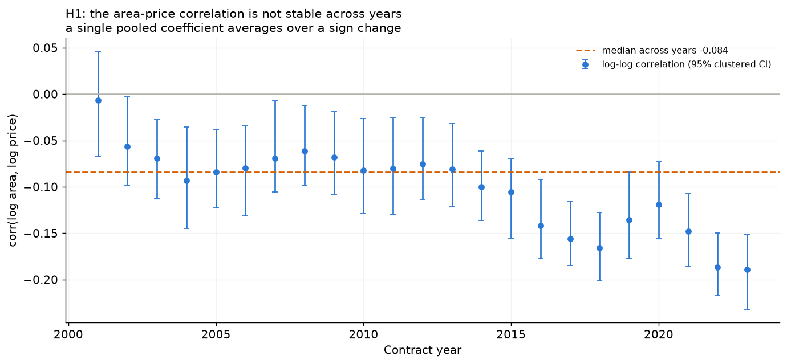

### H2 — area versus unit price

| measure | coefficient | n |
|---|---|---|
| corr(log area, log unit price) | -0.5149 | 800000 |

Shuffled-price placebo (the mechanical component):

| label | y | x | absorbed | regressors | n | n_clusters | absorbed_levels | coef__log_area | se__log_area | coef | se | ci_low | ci_high | test_value | z_statistic | p_value |
|---|---|---|---|---|---|---|---|---|---|---|---|---|---|---|---|---|
| log price ~ log area | postcode + year FE (test beta=1) | log_price | log_area | post_code+year | log_area | 800000 | 591 | 614 | 0.2463 | 0.0077 | 0.2463 | 0.0077 | 0.2311 | 0.2614 | 1.0000 | -97.4521 | 0.0000 |

Observed corr(log area, log unit price) = -0.515. Under the shuffled-price placebo the same statistic is -0.437 (95% band -0.438..-0.435), so about 85% of the observed association is the mechanical ratio effect. The elasticity estimate (log price on log area, within postcode and year) is 0.246 with a test of beta=1 giving p=0; a slope below 1 means unit price genuinely falls with size once location and time are held fixed.

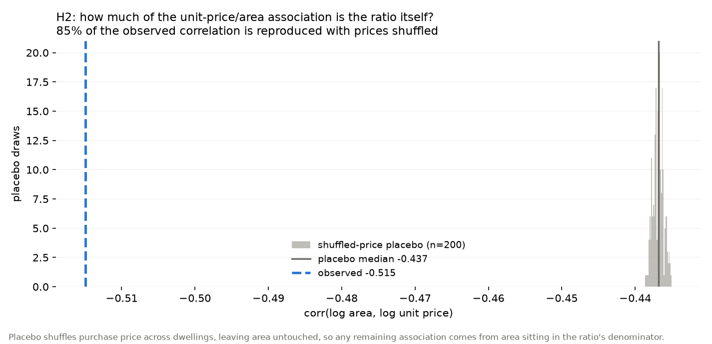

### Robustness: controlling for the lagged neighbourhood price

`pc_med_price_*` is a function of prices in the same postcode, and area is a component of price. It therefore sits *downstream* of the regressor on the causal path (area -> price -> neighbourhood median). Conditioning on it absorbs part of the very variation being estimated and biases the area coefficient toward zero, so these estimates are a lower bound and are reported for transparency only, never as the headline.

H1 under three specifications (same sample, same fixed effects, clustered by postcode):

| label | y | x | absorbed | regressors | n | n_clusters | absorbed_levels | coef__log_area | se__log_area | coef | se | ci_low | ci_high | coef__log_lag_price | se__log_lag_price | coef__log_lag_price_c | se__log_lag_price_c | coef__log_area_x_lag_c | se__log_area_x_lag_c |
|---|---|---|---|---|---|---|---|---|---|---|---|---|---|---|---|---|---|---|---|
| H1-R0 main (postcode + year FE) | log_price | log_area | post_code+year | log_area | 800000 | 591 | 614 | 0.2463 | 0.0077 | 0.2463 | 0.0077 | 0.2311 | 0.2614 |  |  |  |  |  |  |
| H1-R1 + neighbourhood price (bad control) | log_price | log_area | post_code+year | log_area+log_lag_price | 778476 | 518 | 541 | 0.2491 | 0.0076 | 0.2491 | 0.0076 | 0.2342 | 0.2641 | 0.6999 | 0.0117 |  |  |  |  |
| H1-R2 + area x neighbourhood price (centred) | log_price | log_area | post_code+year | log_area+log_lag_price_c+log_area_x_lag_c | 778476 | 518 | 541 | 0.2501 | 0.0075 | 0.2501 | 0.0075 | 0.2354 | 0.2648 |  |  | 0.9374 | 0.0529 | -0.0851 | 0.0180 |

H2 (elasticity, test of beta = 1):

| label | y | x | absorbed | regressors | n | n_clusters | absorbed_levels | coef__log_area | se__log_area | coef | se | ci_low | ci_high | test_value | z_statistic | p_value | coef__log_lag_price | se__log_lag_price |
|---|---|---|---|---|---|---|---|---|---|---|---|---|---|---|---|---|---|---|
| H2-R0 main elasticity (test beta = 1) | log_price | log_area | post_code+year | log_area | 800000 | 591 | 614 | 0.2463 | 0.0077 | 0.2463 | 0.0077 | 0.2311 | 0.2614 | 1.0000 | -97.4521 | 0.0000 |  |  |
| H2-R1 + neighbourhood price (bad control) | log_price | log_area | post_code+year | log_area+log_lag_price | 778476 | 518 | 541 | 0.2491 | 0.0076 | 0.2491 | 0.0076 | 0.2342 | 0.2641 | 1.0000 | -98.3485 | 0.0000 | 0.6999 | 0.0117 |

Controlling for the lagged neighbourhood price moves the area elasticity from +0.246 to +0.249 (+1.2%). The estimate barely moves, so the area gradient does **not** appear to run through neighbourhood price momentum and the bad-control concern is, empirically, second-order here. That is a finding, not a reassurance: it means the pooled negative correlation was about *between-postcode* differences, which the postcode fixed effects already absorb. The interaction term is -0.085 (se 0.018, z -4.7), so the area gradient does vary with the local market level. In the interaction specification the main effect is evaluated at the average neighbourhood price because the term is centred.

## 3. Metro event study (W5)

* Event: **Sydney Metro Northwest opening**, 2019-05-26 (all 13 stations opened together, so there is a single treatment cohort and the two-way fixed-effects estimator is exact rather than an approximation).
* Treated postcodes at 2.0 km: 11 ['2113', '2119', '2121', '2122', '2125', '2126', '2153', '2154', '2155', '2768', '2769']
* Controls: same four North-West SA4 regions, at least 3.0 km from any new station (38 postcodes).
* Window: ±24 months around the opening; reference period omitted; standard errors clustered by postcode.

**Pre-trend verdict.** pre-trend test REJECTS parallel trends (p = 1.09e-06), so the Metro coefficients are reported as **descriptive**, not causal.

The pre-trend rejection is the single most important result in this section: with 21 pre-period coefficients jointly different from zero, the treated and control postcodes were already on different price paths before 26 May 2019. The binary coefficient (mean post-period +0.0369 log10, about +8.9% on the median unit price) therefore mixes the station with pre-existing divergence.

| n_pre_coefficients | wald_statistic | dof | p_value | max_abs_pre_coef | interpretation |
|---|---|---|---|---|---|
| 21 | 66.9221 | 21 | 0.0000 | 0.0425 | p < 0.05 rejects parallel pre-trends; report the design as descriptive rather than causal |

Placebo checks (both should be indistinguishable from zero):

| placebo | mean_post_coef | max_abs_post_coef | pretrend_p_value | pretrend_p_share_below_0_05 | n_obs |
|---|---|---|---|---|---|
| shifted_event_date | 0.0000 | 0.0317 | 0.0287 |  | 605 |
| random_treatment | -0.0044 | 0.0201 | 0.0000 | 1.0000 | 2270 |

Robustness grid:

| specification | radius_km | outcome | treated_postcodes | mean_post_coef | pretrend_p_value | n_obs |
|---|---|---|---|---|---|---|
| main | 2.0000 | log_median_unit_price | 11 | 0.0369 | 0.0000 | 2270 |
| radius_1km | 1.0000 | log_median_unit_price | 4 | 0.0016 | 0.8728 | 236 |
| radius_3km | 3.0000 | log_median_unit_price | 14 | 0.0371 | 0.0004 | 2416 |
| outcome_log_median_price | 2.0000 | log_median_price | 11 | 0.0383 | 0.0000 | 2270 |
| outcome_n_sales | 2.0000 | n_sales | 11 | 1.5560 | 0.0000 | 2270 |

Dose-response (continuous exposure; the preferred design given how few postcodes are within 2 km):

| specification | outcome | max_km | coef_post_x_log_dist | se | ci_low | ci_high | p_value | n_obs | n_postcodes | interpretation |
|---|---|---|---|---|---|---|---|---|---|---|
| dose_response | log_median_unit_price | 5.0000 | -0.0041 | 0.0082 | -0.0202 | 0.0121 | 0.6219 | 1066 | 22 | negative interaction = the post-opening change is larger closer to the station |
| dose_response | log_median_unit_price | 10.0000 | -0.0156 | 0.0042 | -0.0239 | -0.0073 | 0.0002 | 1645 | 35 | negative interaction = the post-opening change is larger closer to the station |

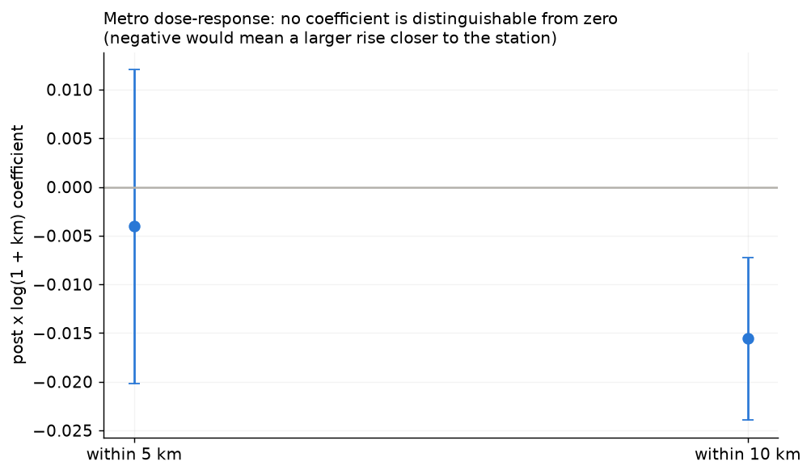

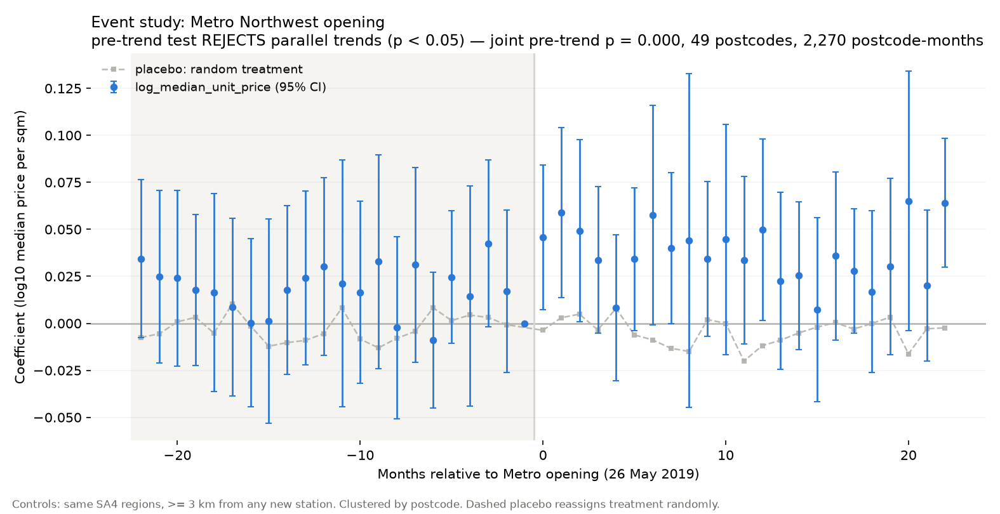

## 4. Models and rolling-origin CV (W3-W4)

Target: `log10(purchase_price)`. Folds: 8 forward-chaining windows (train months 84+, horizon 12 months, embargo 1 month(s)), purged by dwelling.

Pooled across folds:

| model | n | rmsle | rmse_log10 | mae_log10 | r2_log10 | mae_aud | rmse_aud | mdape_pct | mape_pct |
|---|---|---|---|---|---|---|---|---|---|
| xgboost | 577992 | 0.3182 | 0.1382 | 0.0956 | 0.7489 | 133,982.9368 | 211,130.3316 | 15.3864 | 24.6950 |
| random_forest | 577992 | 0.3212 | 0.1395 | 0.0967 | 0.7442 | 135,530.8732 | 213,216.1035 | 15.5507 | 24.9340 |
| linear_ridge | 577992 | 0.3453 | 0.1500 | 0.1080 | 0.7043 | 152,331.6570 | 236,245.9203 | 18.0909 | 27.5598 |
| naive_postcode_month | 577992 | 0.3622 | 0.1573 | 0.1073 | 0.6747 | 149,224.5976 | 244,294.2241 | 16.5142 | 26.9627 |
| naive_global_median | 577992 | 0.7065 | 0.3068 | 0.2457 | -0.2377 | 335,937.6150 | 499,822.3753 | 40.9722 | 46.3731 |

The naive benchmark predicts the postcode's trailing 12-month median price using only lagged information. Beating it is the minimum bar for a feature set to be worth anything.

**The ranking is much tighter than it looks at first glance.** `xgboost` beats the naive benchmark by 0.0440 RMSLE pooled (0.3182 vs 0.3622, about a 12% reduction), and it wins in **8 of 8 folds**. On the final holdout (below) the gap is 0.0413. So the honest summary is that a 53-dimensional engineered feature set buys a consistent but modest improvement over one number — the local recent median — and the benchmark is never far behind.

Two caveats when reading this table:

* `linear_ridge` has the **best median** percentage error among the single-equation models in 0 of 8 folds but the **worst tail**: its `rmse_aud` is inflated by a handful of extreme predictions on cheap dwellings, so on dollar-scale tail risk it is the least reliable of the three. Its per-fold RMSLE also swings (0.32 to 0.38), i.e. it is the least stable.
* `random_forest` and `xgboost` are within ~0.003 RMSLE of each other on average and their fold-to-fold ordering flips 0 times, so they should be treated as equivalent on this data; the ranking is not stable enough to justify a strong claim.

Per-fold detail:

| model | n | rmsle | rmse_log10 | mae_log10 | r2_log10 | mae_aud | rmse_aud | mdape_pct | mape_pct | fold | valid_start | valid_end | train_rows | valid_rows |
|---|---|---|---|---|---|---|---|---|---|---|---|---|---|---|
| naive_postcode_month | 66170 | 0.3615 | 0.1570 | 0.1084 | 0.5931 | 111,221.6143 | 200,230.1681 | 17.2414 | 27.0253 | 0 | 2008-02 | 2009-01 | 485548 | 66170 |
| naive_global_median | 66170 | 0.5849 | 0.2540 | 0.1914 | -0.0651 | 195,864.8415 | 329,040.2060 | 31.8600 | 41.4574 | 0 | 2008-02 | 2009-01 | 485548 | 66170 |
| linear_ridge | 66170 | 0.3545 | 0.1540 | 0.1140 | 0.6088 | 117,252.5375 | 187,197.8667 | 21.1144 | 30.3006 | 0 | 2008-02 | 2009-01 | 485548 | 66170 |
| random_forest | 66170 | 0.3206 | 0.1392 | 0.0976 | 0.6800 | 100,589.4433 | 175,622.6660 | 16.0127 | 24.5806 | 0 | 2008-02 | 2009-01 | 485548 | 66170 |
| xgboost | 66170 | 0.3197 | 0.1389 | 0.0974 | 0.6817 | 100,207.6076 | 173,794.2856 | 16.0769 | 24.7425 | 0 | 2008-02 | 2009-01 | 485548 | 66170 |
| naive_postcode_month | 71430 | 0.3542 | 0.1538 | 0.1065 | 0.6317 | 124,544.2820 | 212,880.3469 | 16.5974 | 25.9447 | 1 | 2010-02 | 2011-01 | 625793 | 71430 |
| naive_global_median | 71430 | 0.6433 | 0.2794 | 0.2139 | -0.2150 | 247,089.0073 | 395,460.2595 | 34.6154 | 41.9786 | 1 | 2010-02 | 2011-01 | 625793 | 71430 |
| linear_ridge | 71430 | 0.3266 | 0.1418 | 0.1012 | 0.6868 | 118,551.6732 | 195,661.1887 | 16.7118 | 25.0448 | 1 | 2010-02 | 2011-01 | 625793 | 71430 |
| random_forest | 71430 | 0.3186 | 0.1384 | 0.0980 | 0.7019 | 117,332.8001 | 197,956.6919 | 15.8593 | 23.9470 | 1 | 2010-02 | 2011-01 | 625793 | 71430 |
| xgboost | 71430 | 0.3179 | 0.1381 | 0.0977 | 0.7033 | 116,951.8209 | 197,024.3652 | 15.8353 | 24.1448 | 1 | 2010-02 | 2011-01 | 625793 | 71430 |
| naive_postcode_month | 67653 | 0.3509 | 0.1524 | 0.1046 | 0.6283 | 121,148.7706 | 206,421.8462 | 16.4062 | 25.9728 | 2 | 2012-02 | 2013-01 | 764091 | 67653 |
| naive_global_median | 67653 | 0.6246 | 0.2712 | 0.2090 | -0.1778 | 241,146.2313 | 380,969.0546 | 34.8148 | 42.3286 | 2 | 2012-02 | 2013-01 | 764091 | 67653 |
| linear_ridge | 67653 | 0.3232 | 0.1404 | 0.1008 | 0.6845 | 116,789.3342 | 183,468.0200 | 17.3899 | 26.3887 | 2 | 2012-02 | 2013-01 | 764091 | 67653 |
| random_forest | 67653 | 0.3068 | 0.1332 | 0.0938 | 0.7159 | 109,351.5335 | 178,737.6755 | 15.3726 | 23.4439 | 2 | 2012-02 | 2013-01 | 764091 | 67653 |
| xgboost | 67653 | 0.3066 | 0.1331 | 0.0938 | 0.7162 | 109,323.6156 | 178,769.1271 | 15.3163 | 23.4116 | 2 | 2012-02 | 2013-01 | 764091 | 67653 |
| naive_postcode_month | 84087 | 0.3481 | 0.1512 | 0.1044 | 0.6719 | 143,532.6949 | 235,290.2157 | 16.2736 | 25.1879 | 3 | 2014-02 | 2015-01 | 892511 | 84087 |
| naive_global_median | 84087 | 0.7173 | 0.3115 | 0.2468 | -0.3935 | 326,682.7831 | 490,428.2641 | 40.0000 | 45.2810 | 3 | 2014-02 | 2015-01 | 892511 | 84087 |
| linear_ridge | 84087 | 0.3346 | 0.1453 | 0.1079 | 0.6968 | 150,499.7924 | 232,460.5663 | 18.5618 | 25.4459 | 3 | 2014-02 | 2015-01 | 892511 | 84087 |
| random_forest | 84087 | 0.3067 | 0.1332 | 0.0929 | 0.7453 | 128,340.7486 | 204,992.8359 | 15.1150 | 23.1906 | 3 | 2014-02 | 2015-01 | 892511 | 84087 |
| xgboost | 84087 | 0.3035 | 0.1318 | 0.0920 | 0.7505 | 127,251.1614 | 202,331.2159 | 14.9752 | 23.0638 | 3 | 2014-02 | 2015-01 | 892511 | 84087 |
| naive_postcode_month | 77622 | 0.3543 | 0.1539 | 0.1033 | 0.6753 | 150,119.4423 | 243,619.4165 | 15.6915 | 25.9532 | 4 | 2016-02 | 2017-01 | 1057595 | 77622 |
| naive_global_median | 77622 | 0.7500 | 0.3257 | 0.2648 | -0.4554 | 374,063.3543 | 541,579.9454 | 43.5036 | 48.2226 | 4 | 2016-02 | 2017-01 | 1057595 | 77622 |
| linear_ridge | 77622 | 0.3391 | 0.1473 | 0.1073 | 0.7024 | 159,129.3495 | 239,475.6660 | 18.0938 | 26.6244 | 4 | 2016-02 | 2017-01 | 1057595 | 77622 |
| random_forest | 77622 | 0.3108 | 0.1350 | 0.0923 | 0.7500 | 135,635.0421 | 210,424.1626 | 14.7331 | 23.8934 | 4 | 2016-02 | 2017-01 | 1057595 | 77622 |
| xgboost | 77622 | 0.3078 | 0.1337 | 0.0914 | 0.7549 | 134,569.2939 | 209,024.5238 | 14.6118 | 23.5150 | 4 | 2016-02 | 2017-01 | 1057595 | 77622 |
| naive_postcode_month | 66360 | 0.3651 | 0.1586 | 0.1062 | 0.6451 | 157,633.9493 | 250,167.9125 | 16.2611 | 28.1242 | 5 | 2018-02 | 2019-01 | 1215393 | 66360 |
| naive_global_median | 66360 | 0.7299 | 0.3170 | 0.2607 | -0.4182 | 373,611.3853 | 531,456.9942 | 43.4028 | 49.1218 | 5 | 2018-02 | 2019-01 | 1215393 | 66360 |
| linear_ridge | 66360 | 0.3440 | 0.1494 | 0.1043 | 0.6851 | 156,888.1847 | 241,005.2890 | 16.5634 | 27.5208 | 5 | 2018-02 | 2019-01 | 1215393 | 66360 |
| random_forest | 66360 | 0.3239 | 0.1407 | 0.0953 | 0.7208 | 141,700.2111 | 215,407.9477 | 15.1748 | 25.8607 | 5 | 2018-02 | 2019-01 | 1215393 | 66360 |
| xgboost | 66360 | 0.3190 | 0.1386 | 0.0936 | 0.7291 | 139,041.1147 | 212,859.1355 | 14.7875 | 25.2288 | 5 | 2018-02 | 2019-01 | 1215393 | 66360 |
| naive_postcode_month | 80676 | 0.3780 | 0.1642 | 0.1128 | 0.6128 | 172,325.8488 | 266,416.5558 | 16.8696 | 28.7896 | 6 | 2020-02 | 2021-01 | 1335838 | 80676 |
| naive_global_median | 80676 | 0.7315 | 0.3177 | 0.2616 | -0.4502 | 391,616.1846 | 551,476.3775 | 43.3333 | 49.0298 | 6 | 2020-02 | 2021-01 | 1335838 | 80676 |
| linear_ridge | 80676 | 0.3631 | 0.1577 | 0.1101 | 0.6427 | 172,734.0347 | 258,792.5352 | 17.2486 | 30.4950 | 6 | 2020-02 | 2021-01 | 1335838 | 80676 |
| random_forest | 80676 | 0.3377 | 0.1467 | 0.1024 | 0.6909 | 156,996.3119 | 233,755.3440 | 15.9587 | 26.4868 | 6 | 2020-02 | 2021-01 | 1335838 | 80676 |
| xgboost | 80676 | 0.3341 | 0.1451 | 0.1004 | 0.6975 | 153,188.7446 | 228,285.9917 | 15.7034 | 26.3986 | 6 | 2020-02 | 2021-01 | 1335838 | 80676 |
| naive_postcode_month | 63994 | 0.3869 | 0.1680 | 0.1128 | 0.5572 | 214,299.1446 | 320,667.6418 | 17.0588 | 29.1293 | 7 | 2022-02 | 2022-12 | 1512692 | 63994 |
| naive_global_median | 63994 | 0.8336 | 0.3620 | 0.3161 | -1.0560 | 536,813.5122 | 684,352.0985 | 51.3250 | 53.6288 | 7 | 2022-02 | 2022-12 | 1512692 | 63994 |
| linear_ridge | 63994 | 0.3769 | 0.1637 | 0.1193 | 0.5796 | 227,599.1264 | 322,974.4813 | 19.6825 | 29.0237 | 7 | 2022-02 | 2022-12 | 1512692 | 63994 |
| random_forest | 63994 | 0.3453 | 0.1500 | 0.1017 | 0.6473 | 195,512.1349 | 274,356.6457 | 16.4567 | 28.6105 | 7 | 2022-02 | 2022-12 | 1512692 | 63994 |
| xgboost | 63994 | 0.3384 | 0.1470 | 0.0996 | 0.6612 | 192,662.7404 | 273,480.5378 | 16.0572 | 27.4906 | 7 | 2022-02 | 2022-12 | 1512692 | 63994 |

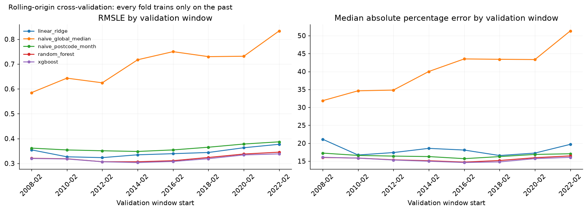

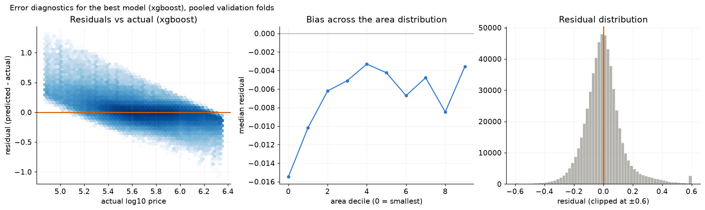

Top features (last fold only, indicative):

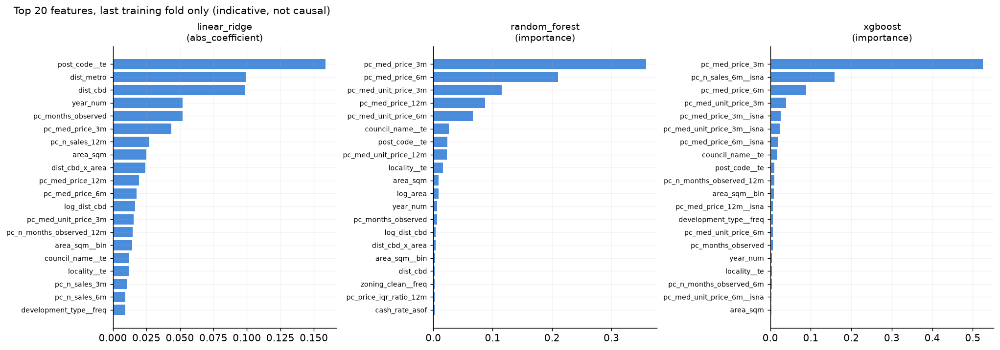

### Final holdout

The final **12 months (2023-01 to 2023-12)** were never used by any fold: no model, feature or hyper-parameter choice was informed by them. The model was trained once on everything before the holdout and scored once.

| model | n | rmsle | rmse_log10 | mae_log10 | r2_log10 | mae_aud | rmse_aud | mdape_pct | mape_pct | is_best_from_cv |
|---|---|---|---|---|---|---|---|---|---|---|
| xgboost | 64582 | 0.3305 | 0.1435 | 0.0982 | 0.6469 | 192,059.4330 | 274,001.9456 | 15.5864 | 25.9226 | True |
| random_forest | 64582 | 0.3327 | 0.1445 | 0.0983 | 0.6422 | 192,633.9332 | 274,054.9927 | 15.5649 | 26.4776 | False |
| linear_ridge | 64582 | 0.3535 | 0.1535 | 0.1072 | 0.5961 | 213,426.0219 | 310,469.7834 | 17.2126 | 27.9706 | False |
| naive_postcode_month | 64582 | 0.3718 | 0.1615 | 0.1072 | 0.5531 | 206,762.6368 | 307,717.9873 | 16.0469 | 28.2876 | False |
| naive_global_median | 64582 | 0.8153 | 0.3541 | 0.3084 | -1.1491 | 532,150.4137 | 678,849.5204 | 50.0000 | 52.0910 | False |

Read this as the honest out-of-sample number. It differs from the rolling figure above because it is a single later period (with its own market conditions) rather than an average of nine windows, and it is scored on the **full population** rather than on rows the training fence accepted.

## 4.5 Do the engineered features earn their place? (feature-value test)

This asks a different question from H1/H2 (world relationships) and H3 (the Metro effect): **do our own engineered features add out-of-sample predictive value?** Same folds, same group purge, same embargo; model = XGBoost (200 rounds) to keep ~100 fits affordable.

Layers are cumulative, so each row's delta is that layer's marginal contribution:

| layer | what it adds |
|---|---|
| L0 | property + location (area, distances) |
| L1 | + calendar (`year_num`, `month_sin`, `month_cos`) |
| L2 | + region labels (postcode / council / locality / zoning / development) |
| L3 | + **lagged price statistics** `pc_med_price_{3,6,12}m` |
| L4 | + lagged unit price `pc_med_unit_price_{3,6,12}m` |
| D1 | + price **dispersion** `pc_price_iqr_ratio_12m` |
| Q1 | + **liquidity & coverage** (`pc_n_sales_*`, `pc_n_months_observed_*`, staleness) |
| M1 | + **macro block** (`cash_rate_asof`, `cpi_yoy_asof`) |

Three notes on how to read this.

**The macro layer sits last on purpose.** Both macro columns are pure functions of the contract date (43 and 93 distinct values across 276 months), so they are near-collinear with `year_num` from L1. Measured last, the increment answers the strict question — once you know where the property is, when it sold, how big it is and what the neighbourhood has been selling for, does the cash rate tell you anything more? Credited earlier, the macro block would simply be collecting the time trend's contribution.

**Dispersion and liquidity are separate layers, not one block.** An earlier version grouped `pc_price_iqr_ratio_12m` with the sales-count and coverage columns under the single label "liquidity". They are different ideas — the ratio says how *heterogeneous* a postcode's stock is, while the counts say how *active* it is and how much evidence sits behind the rolling medians — and lumping them together made the negative increment impossible to attribute.

**Contributions are consecutive differences**, so each layer is charged for whatever the layer immediately before it did. That is why layer order matters and why the ordering above is deliberate rather than arbitrary.

| layer | rmsle_mean | rmsle_std | mdape_mean | folds | rmsle_delta_vs_prev | folds_improved_vs_prev |
|---|---|---|---|---|---|---|
| L0_property_location | 0.3870 | 0.0493 | 23.1068 | 8 |  |  |
| L1_plus_calendar | 0.3435 | 0.0208 | 17.7011 | 8 | -0.0435 | 8.0000 |
| L2_plus_labels | 0.3312 | 0.0175 | 17.0913 | 8 | -0.0123 | 8.0000 |
| L3_plus_lagged_price | 0.3261 | 0.0145 | 16.4109 | 8 | -0.0051 | 7.0000 |
| L4_plus_unit_price | 0.3253 | 0.0144 | 16.3447 | 8 | -0.0008 | 7.0000 |
| D1_plus_dispersion | 0.3261 | 0.0147 | 16.3788 | 8 | 0.0008 | 0.0000 |
| Q1_plus_liquidity_coverage | 0.3263 | 0.0147 | 16.4164 | 8 | 0.0002 | 4.0000 |
| M1_plus_macro | 0.3270 | 0.0164 | 16.5331 | 8 | 0.0007 | 4.0000 |

**The single largest contributor is the calendar features** (-0.0435 RMSLE, 8/8 folds) — measured as the drop in pooled RMSLE from adding that layer on top of the previous one. The next largest is **the property/region label block** (-0.0123 RMSLE, 8/8 folds). Layers are cumulative, so each delta is that block's marginal value once everything before it is present. **3 of the 7 blocks make things worse:** the price-dispersion column, the macro block (RBA cash rate and CPI), the liquidity and coverage block (+0.0008, +0.0007, +0.0002 RMSLE respectively). The leanest model that beats all of them is **L4_plus_unit_price** at **0.3253** mean RMSLE (8 folds), against 0.3270 for the full set.

**Falsification tests** (anchor fold, L3 specification):

* *Permutation placebo* — the same columns with values shuffled across postcodes inside the training fold, so the marginal distribution and the missingness pattern survive but the postcode↔value link is destroyed.
* *Time reversal* — forward-looking windows (t+1..t+k) instead of lagged ones. If the future version predicts materially better, the lag/embargo machinery is not working.

| placebo | trial | rmsle |
|---|---|---|
| permutation | 0 | 0.3613 |
| permutation | 1 | 0.3617 |
| permutation | 2 | 0.3617 |
| permutation | 3 | 0.3623 |
| permutation | 4 | 0.3625 |
| permutation | 5 | 0.3621 |
| permutation | 6 | 0.3617 |
| permutation | 7 | 0.3616 |
| permutation | 8 | 0.3619 |
| permutation | 9 | 0.3620 |
| time_reversal | 0 | 0.3575 |

**N1: is the lagged price signal location level or timing?** Re-running L3 with each lagged price column demeaned within its postcode (postcode means from the training fold) removes the between-postcode level. If the increment collapses, the columns are only a stand-in for "which postcode is expensive".

| fold | rmsle |
|---|---|
| 6 | 0.3425 |
| 7 | 0.3605 |

### 4.6 Which metric should be used, and why MdAPE and RMSLE can disagree

`xgboost` wins on **every** metric listed, including the median percentage error — unlike earlier runs of this pipeline, where RMSLE and MdAPE pointed in opposite directions. Whether that reversal appears is a property of the sample rather than of the metric definitions, so it is worth re-checking on fresh data. On the final holdout:

| metric | xgboost | naive_postcode_month | winner |
|---|---|---|---|
| RMSLE | **0.3305** | 0.3718 | xgboost |
| R² (log10) | **0.647** | 0.553 | xgboost |
| MAE (log10) | **0.0982** | 0.1072 | xgboost |
| MdAPE | **15.59%** | 16.05% | xgboost |
| MAE (AUD, median back-transform) | **192,059** | 206,763 | xgboost |
| RMSE (AUD) | **274,002** | 307,718 | xgboost |

**Why they can disagree.** Both metrics punish proportional error, but they weight the price
distribution differently:

* **RMSLE lives in log space, so it is scale-free.** Missing a $4M house by 40% costs exactly
the same as missing a $250k house by 40%. One number therefore summarises accuracy across the
whole price range, and a single catastrophic miss on an unusual property shows up clearly.
* **MdAPE is a raw percentage on the dollar scale.** It is dominated by cheap properties, where
the same dollar error becomes a huge percentage. The median then sits close to the *typical*
cheap sale.

**Where each model actually wins.** Splitting the same rows by actual-price quintile makes the
trade-off visible:

| price band | n | xgboost MdAPE | naive MdAPE | xgboost mean APE | naive mean APE |
|---|---|---|---|---|---|
| Q1 cheapest | 115,599 | **24.4%** | 26.6% | **50.7%** | 55.9% |
| Q2 | 115,598 | 13.2% | **12.7%** | 19.1% | **18.6%** |
| Q3 | 115,598 | **13.7%** | 15.0% | **17.6%** | 18.7% |
| Q4 | 115,598 | **13.0%** | 14.2% | **16.6%** | 18.4% |
| Q5 dearest | 115,599 | **16.5%** | 18.7% | **19.5%** | 23.2% |

`xgboost` wins on mean APE in **4 of 5** price bands, the benchmark in the rest. MdAPE is a median over a mixture, so its overall value is dragged by whichever band the benchmark wins, even when it loses badly in the band that matters most for tail risk.

**Which to report, and for what.**

| purpose | metric | why |
|---|---|---|
| model selection / headline accuracy | **RMSLE** | scale-free, comparable across folds and price levels, sensitive to catastrophic misses |
| communicating to a non-technical reader | **MdAPE** | "half of homes are predicted within X%" is immediately legible |
| fairness across the price range | **per-quintile APE** | a single number hides that the models win in different segments |
| dollar impact | MAE/RMSE in AUD, **with the tail disclosed** | RMSE in dollars was once 100% attributable to a single row; always report the worst-1% share alongside |

**Concentration of error** (pooled folds): the worst 1% of rows carry 22.1% of the total squared log error for xgboost and 20.4% for the benchmark — so both are tail-dominated, and neither number is an artefact of one bad row once the corruption fence is in place.

**Recommended wording for a presentation.** "The model predicts half of homes within 16% and has a lower scaled error than a postcode-median benchmark (0.318 vs 0.362). A simple benchmark is
within ~2 percentage points on typical accuracy, so the value of the feature set is modest; the
model's real advantage is on the cheapest fifth of the market and in avoiding large misses."

### 4.7 Are the models overfitting? A learning curve and a capacity probe

Everything above argues that the models do not overfit **indirectly**: the cross-validation score sits close to the untouched holdout, and the fold-to-fold spread of a learned model is no worse than that of a naive benchmark. Neither observation ever looks at **training** error, so neither measures overfitting head-on. Two experiments close that gap.

**Experiment 1 — learning curve.** On the largest fold (train through 2021-12, validate 2022), the same configuration is refitted on growing amounts of data. The training window always **ends** just before the validation period and only its **start** moves, so sample size changes while the gap to the validation period stays fixed. (Growing from the fold's original 2001 start instead would confound the two: 2% of that window is 2001 data predicting 2022, which scores ~1.3 RMSLE for reasons that have nothing to do with sample size.)

| training rows | window | train RMSLE | early-stop tail | valid RMSLE | gap |
|---|---|---|---|---|---|
| 151,269 | 2020-04..2021-12 | 0.2984 | 0.3169 | 0.3428 | +0.0444 |
| 378,173 | 2016-11..2021-12 | 0.2886 | 0.3229 | 0.3542 | +0.0655 |
| 756,346 | 2011-11..2021-12 | 0.2891 | 0.3278 | 0.3570 | +0.0679 |
| 1,134,519 | 2006-06..2021-12 | 0.2915 | 0.3346 | 0.3664 | +0.0749 |
| 1,512,692 | 2001-01..2021-12 | 0.3005 | 0.3307 | 0.3558 | +0.0553 |

Training error barely moves across a 10x change in training rows (0.2984 → 0.3005), and the gap to validation stays modest throughout (+0.0444 to +0.0749). A model that was memorising would show a large and widening gap; this one does not.

**Adding training rows does not help — it slightly hurts. validation RMSLE changes by +0.0172 across a 10x increase in training rows, and its whole range is only 0.0236: the largest window scores 0.3558 against 0.3428 for the 10% window that only reaches back a few years. This is neither classic overfitting (training error is flat at ~0.300, and the gap is only +0.0553, about 16% of validation error) nor a shortage of data. It means the older transactions carry little usable signal for predicting the near future: house prices are close to a random walk, so 2001 sales are a weak guide to 2022 levels regardless of how many of them there are. The binding constraint is the relevance and informativeness of the features, not the volume of history.**

**Experiment 2 — capacity probe.** The learning curve being flat could mean either (a) the learner has too little capacity to exploit more data, or (b) more data genuinely does not help. To separate them, the limiters are removed deliberately — early stopping off, `max_depth` 12, `min_child_weight` 1, 2000 rounds — and the model is fitted on a small window where it could easily memorise:

| setting | training rows | train RMSLE | valid RMSLE | gap |
|---|---|---|---|---|
| production (600 rounds, early stopping) | 151,269 | 0.2984 | 0.3428 | +0.0444 |
| unregularised probe | 30,253 | 0.1031 | 0.3611 | +0.2580 |

Removing the limiters drives training error down to **0.1031** while validation stays at **0.3611** — a gap of **+0.2580**, roughly 6x the gap the production configuration actually shows. So the algorithm *can* overfit; the regularisation is what stops it, and it costs little accuracy.

**Conclusion.** The binding constraint is not model capacity and not the volume of history — it is the information content of the features, plus the irreducible noise in what any single house sells for. That is also why the headline result is a modest 12% gain over a postcode-median benchmark: there is not much more signal in this feature set to extract, however the model is tuned.

*(Reproduce with `python pipelines/09_learning_curve.py` and `--capacity-probe`; fold 7, 2022-02..2022-12.)*

### 4.8 Do the three net-negative layers matter in production? A matched comparison

§4.5 flags D1 (price dispersion), Q1 (liquidity and coverage) and M1 (macro) as net-negative. That ablation is out-of-sample and lives inside the rolling-origin folds, so it is an honest measurement — **but it runs under different settings from the production model**: the training fold is truncated to the most recent 400,000 rows, XGBoost gets 200 rounds, and early stopping is off. The production model trains on the full window (up to 1.51M rows) for 600 rounds with early stopping.

That gap matters because tree ensembles do not compose: a feature that is worthless at 400k rows and 200 rounds need not be worthless at 1.51M rows and 600 rounds, since the extra rounds can spend themselves on it. So §4.5 establishes *"these layers do not pay for themselves in the ablation's regime"*, which is weaker than the claim we actually want. This section closes the gap with a like-for-like comparison: identical XGBoost configuration, identical fold definitions, identical training windows, with only the feature set differing.

`nocal` is a deliberate **positive control** — it removes the calendar block as well. If dropping calendar features does *not* hurt, the comparison method itself is broken and the other result means nothing.

| feature set | numeric features | mean fold RMSLE | fold sd | early-stop tail | 2023 holdout |
|---|---|---|---|---|---|
| **lean** (drop D1 + Q1 + M1) | 16 | 0.3258 | 0.0134 | 0.2993 | 0.3230 |
| **full** (production today) | 27 | 0.3262 | 0.0146 | 0.2998 | 0.3280 |
| nocal (drop those *and* calendar) | 13 | 0.3274 | 0.0134 | 0.3005 | 0.3291 |

Per-fold difference on the validation windows:

| fold | 0 | 1 | 2 | 3 | 4 | 5 | 6 | 7 | mean |
|---|---|---|---|---|---|---|---|---|---|
| lean − full | -0.0008 | +0.0034 | -0.0002 | -0.0001 | +0.0005 | -0.0006 | -0.0004 | -0.0049 | -0.0004 |

**How to read it.** The fold-level difference is -0.0004 on average, while its fold-to-fold standard deviation is 0.0023 — several times larger. So on the validation folds the honest reading is **neutral**, not "removing them helps": the direction is not consistently established at this noise level.

- At production settings (full training window, 600 rounds, early stopping), the lean model is better on the validation windows by 0.0004 RMSLE on average, winning 6 of 8 folds. The fold-to-fold standard deviation of that difference is 0.0023.
- The mean difference is smaller than its own fold-to-fold standard deviation, so the direction is not consistently established at this noise level. The honest reading is that the three layers are NEUTRAL, not that removing them measurably improves accuracy.
- On the one-shot 2023 holdout — one fit per configuration, so the only genuinely untouched comparison here — the lean model is better by 0.0050 RMSLE (0.3230 against 0.3280).
- Positive control: removing the calendar block as well makes validation error +0.0015 worse on average, in 6 of 8 folds. The method does detect a block that matters, so a near-zero result for the other three is informative rather than a sign that the comparison is broken.

**What this does and does not establish.** It does **not** establish that deleting the three layers improves accuracy — the fold-level evidence is within noise, so any such claim would be overreading. What it does establish is that there is **no evidence they help**, under either the ablation's settings or the production ones, while a 16-feature model matches or beats the 27-feature one on every surface measured. The cost saving is modest at this scale: mean fit time per fold was 17.2s for the lean set against 21.0s for the full one, about 18% faster. Per-row work dominates fitting time here, not feature count, which is also why the 13-feature `nocal` model is not the fastest of the three.

**The production configuration is deliberately left unchanged.** `FeatureSpec` still declares all 27 numeric features, so every number in §4 refers to the full set; switching the default would invalidate the model table, the ablation, and the headline figures in one step. The recommendation is recorded here rather than applied, and `pipelines/10_compare_feature_sets.py` reproduces the comparison on demand.

*(Reproduce with `python pipelines/10_compare_feature_sets.py --rounds 600 --device cuda`.)*

## 5. Figures

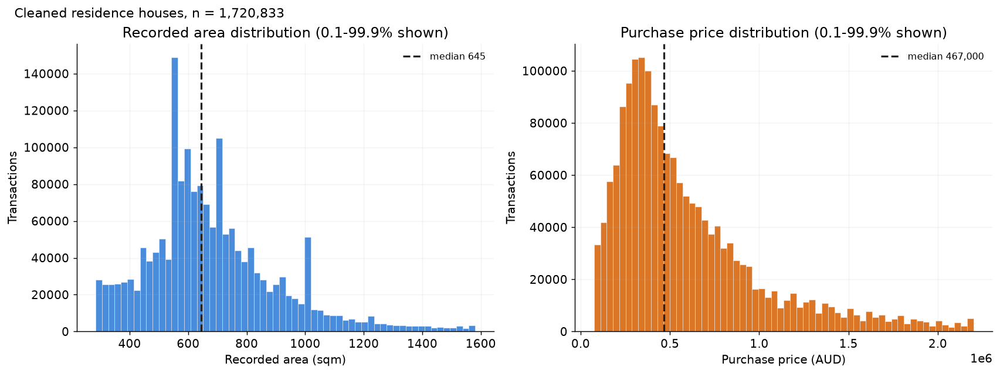

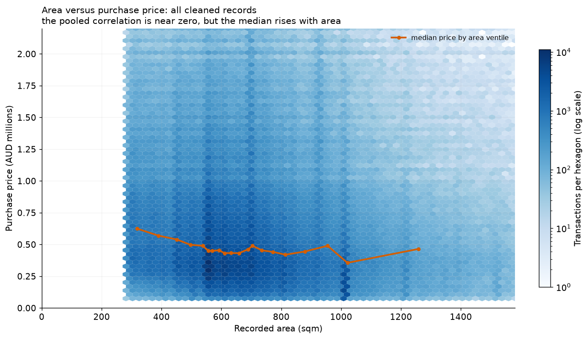

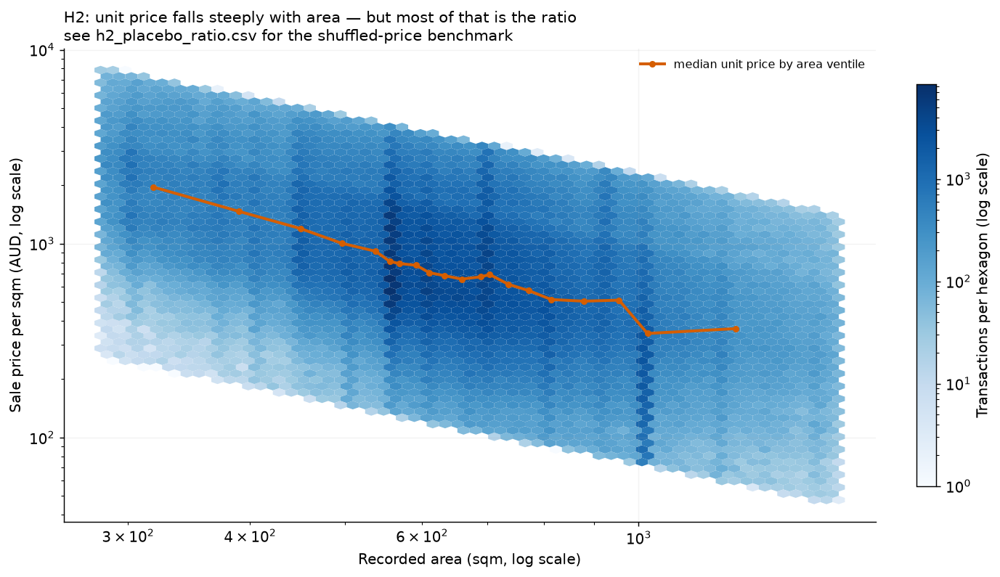

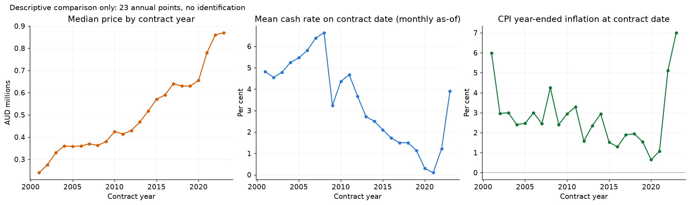

## 6. Known limitations

1. `area_sqm` is the **recorded** area from the Valuer General extract. It is assumed to be known at contract date; this assumption is not verifiable from the file and is flagged in `initial_v0/03_leakage_audit.md` §2.1.
2. 4.8% of cleaned rows have an area above 20,000 sqm and the maximum is 2.7e9 sqm — corrupted or acreage records. Hypothesis tests therefore restrict to 100-5,000 sqm.
3. Transport distances are **postcode-centroid** great-circle distances, not property or walking distances.
4. The Metro study has few treated clusters (8 postcodes at the 2 km radius), so clustered standard errors are imprecise and placebo draws can reject by chance; the 1 km and 3 km radii are reported for this reason.
5. `development_type` is missing for 42% of rows because a legally-timed label only exists from 2011 onward; it is kept as a category with a missing level rather than dropped.
6. Macro levels come from the RBA G1 CPI series, whose index base differs from the annual CPI values hard-coded in the original notebook; levels are not comparable across sources, so the year-ended rate is the feature.

## 7. Reproducing this report

```bash
python pipelines/01_build_clean.py          # raw CSV  -> data/processed/clean.parquet
python pipelines/02_build_features.py       # + macro as-of + panel -> features.parquet
python pipelines/04_train_models.py         # rolling-origin CV -> model tables
python pipelines/05_hypothesis_tests.py     # H1/H2 with placebos
python pipelines/06_event_study.py          # E1 event study
python pipelines/07_make_report.py          # this report + all figures
pytest tests -q                             # contract + leakage + CV guards
```
